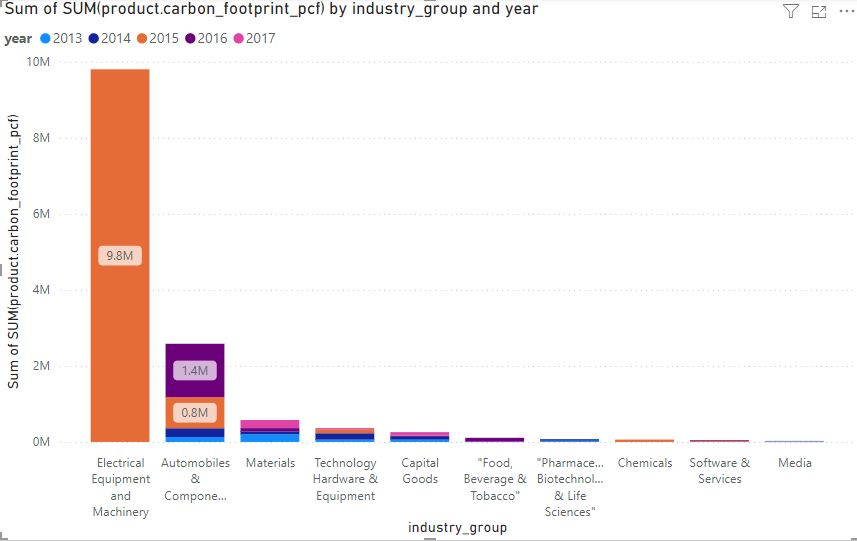

# Carbon-Emission-Analysis

Our dataset is compiled from publicly available data from nature.com and encompasses the product carbon footprints (PCF) for various companies. PCFs represent the greenhouse gas emissions associated with specific products, quantified in CO2 (carbon dioxide equivalent).

Now, let's look up the data:

- ## Product_emissions
```sql
SELECT * FROM product_emissions LIMIT 5;
```

| id           | company_id | country_id | industry_group_id | year | product_name                                                    | weight_kg | carbon_footprint_pcf | upstream_percent_total_pcf | operations_percent_total_pcf | downstream_percent_total_pcf | 
| -----------: | ---------: | ---------: | ----------------: | ---: | --------------------------------------------------------------: | --------: | -------------------: | -------------------------: | ---------------------------: | ---------------------------: | 
| 10056-1-2014 | 82         | 28         | 2                 | 2014 | Frosted Flakes(R) Cereal                                        | 0.7485    | 2                    | 57.50                      | 30.00                        | 12.50                        | 
| 10056-1-2015 | 82         | 28         | 15                | 2015 | "Frosted Flakes, 23 oz, produced in Lancaster, PA (one carton)" | 0.7485    | 2                    | 57.50                      | 30.00                        | 12.50                        | 
| 10222-1-2013 | 83         | 28         | 8                 | 2013 | Office Chair                                                    | 20.68     | 73                   | 80.63                      | 17.36                        | 2.01                         | 
| 10261-1-2017 | 14         | 16         | 25                | 2017 | Multifunction Printers                                          | 110       | 1488                 | 30.65                      | 5.51                         | 63.84                        | 
| 10261-2-2017 | 14         | 16         | 25                | 2017 | Multifunction Printers                                          | 110       | 1818                 | 25.08                      | 4.51                         | 70.41                        | 

  - ## industry_groups
```sql
SELECT * FROM industry_groups LIMIT 5;
```

| id | industry_group                                                         | 
| -: | ---------------------------------------------------------------------: | 
| 1  | "Consumer Durables, Household and Personal Products"                   | 
| 2  | "Food, Beverage & Tobacco"                                             | 
| 3  | "Forest and Paper Products - Forestry, Timber, Pulp and Paper, Rubber" | 
| 4  | "Mining - Iron, Aluminum, Other Metals"                                | 
| 5  | "Pharmaceuticals, Biotechnology & Life Sciences"                       | 

- ## companies
```sql
SELECT * FROM companies LIMIT 5;
```

| id | company_name                  | 
| -: | ----------------------------: | 
| 1  | "Autodesk, Inc."              | 
| 2  | "Casio Computer Co., Ltd."    | 
| 3  | "Cisco Systems, Inc."         | 
| 4  | "CNX Coal Resources, LP"      | 
| 5  | "Coca-Cola Enterprises, Inc." | 

- ## countries
```sql
SELECT * FROM countries LIMIT 5;
```

| id | country_name | 
| -: | -----------: | 
| 1  | Australia    | 
| 2  | Belgium      | 
| 3  | Brazil       | 
| 4  | Canada       | 
| 5  | Chile        | 
  


## Which products contribute the most to carbon emissions?


```sql
SELECT product_name,SUM(carbon_footprint_pcf) FROM product_emissions GROUP BY product_name
ORDER BY SUM(carbon_footprint_pcf) DESC LIMIT 3;
```

| product_name                 | SUM(carbon_footprint_pcf) | 
| ---------------------------: | ------------------------: | 
| Wind Turbine G128 5 Megawats | 3718044                   | 
| Wind Turbine G132 5 Megawats | 3276187                   | 
| Wind Turbine G114 2 Megawats | 1532608                   | 


## The industry groups of these products

```sql
SELECT DISTINCT indust.industry_group
FROM product_emissions product
JOIN industry_groups indust
ON product.industry_group_id=indust.id
WHERE product.product_name LIKE '%Wind Turbine%';
```

| industry_group                     | 
| ---------------------------------: | 
| Electrical Equipment and Machinery | 


## the industries with the highest contribution to carbon emissions

```sql
SELECT
     indust.industry_group, SUM(product.carbon_footprint_pcf) 
FROM industry_groups indust
JOIN product_emissions product 
ON
product.industry_group_id=indust.id
GROUP BY indust.industry_group
ORDER BY SUM(product.carbon_footprint_pcf) DESC LIMIT 1;
```

| industry_group                     | SUM(product.carbon_footprint_pcf) | 
| ---------------------------------: | --------------------------------: | 
| Electrical Equipment and Machinery | 9801558                           | 


## the companies with the highest contribution to carbon emissions

```SQL
SELECT
	com.company_name,SUM(carbon_footprint_pcf) 
FROM companies com
JOIN product_emissions product 
ON
com.id=product.company_id
GROUP BY com.company_name ORDER BY SUM(carbon_footprint_pcf) DESC LIMIT 1;
```

| company_name                           | SUM(carbon_footprint_pcf) | 
| -------------------------------------: | ------------------------: | 
| "Gamesa Corporación Tecnológica, S.A." | 9778464                   | 


## the countries with the highest contribution to carbon emissions
```SQL
SELECT
	c.country_name, SUM(carbon_footprint_pcf)
FROM countries c
JOIN product_emissions product 
ON
c.id=product.country_id
GROUP BY c.country_name ORDER BY SUM(carbon_footprint_pcf) DESC LIMIT 10; 
```

| country_name | SUM(carbon_footprint_pcf) | 
| -----------: | ------------------------: | 
| Spain        | 9786130                   | 
| Germany      | 2251225                   | 
| Japan        | 653237                    | 
| USA          | 518381                    | 
| South Korea  | 186965                    | 
| Brazil       | 169337                    | 
| Luxembourg   | 167007                    | 
| Netherlands  | 70417                     | 
| Taiwan       | 62875                     | 
| India        | 24574                     | 


## The trend of carbon footprints (PCFs) over the years

```sql
SELECT year, SUM(carbon_footprint_pcf) FROM product_emissions GROUP BY year;
```

| year | SUM(carbon_footprint_pcf) | 
| ---: | ------------------------: | 
| 2013 | 503857                    | 
| 2014 | 624226                    | 
| 2015 | 10840415                  | 
| 2016 | 1640182                   | 
| 2017 | 340271                    | 

 


## Which industry groups has demonstrated the most notable decrease in carbon footprints (PCFs) over time

```sql
SELECT indust.industry_group, SUM(product.carbon_footprint_pcf), product.year
FROM
product_emissions product
JOIN
industry_groups indust
ON indust.id=product.industry_group_id 
GROUP BY indust.industry_group, product.year ORDER BY SUM(product.carbon_footprint_pcf) DESC;
```

| industry_group                                                         | SUM(product.carbon_footprint_pcf) | year | 
| ---------------------------------------------------------------------: | --------------------------------: | ---: | 
| Electrical Equipment and Machinery                                     | 9801558                           | 2015 | 
| Automobiles & Components                                               | 1404833                           | 2016 | 
| Automobiles & Components                                               | 817227                            | 2015 | 
| Automobiles & Components                                               | 230015                            | 2014 | 
| Materials                                                              | 213137                            | 2017 | 
| Materials                                                              | 200513                            | 2013 | 
| Technology Hardware & Equipment                                        | 167361                            | 2014 | 
| Automobiles & Components                                               | 130189                            | 2013 | 
| Technology Hardware & Equipment                                        | 106157                            | 2015 | 
| "Food, Beverage & Tobacco"                                             | 100289                            | 2016 | 
| Capital Goods                                                          | 94949                             | 2017 | 
| Capital Goods                                                          | 93699                             | 2014 | 
| Materials                                                              | 88267                             | 2016 | 
| Materials                                                              | 75678                             | 2014 | 
| Chemicals                                                              | 62369                             | 2015 | 
| Technology Hardware & Equipment                                        | 61100                             | 2013 | 
| Capital Goods                                                          | 60190                             | 2013 | 
| "Pharmaceuticals, Biotechnology & Life Sciences"                       | 40215                             | 2014 | 
| "Pharmaceuticals, Biotechnology & Life Sciences"                       | 32271                             | 2013 | 
| Technology Hardware & Equipment                                        | 27592                             | 2017 | 
| Software & Services                                                    | 22856                             | 2015 | 
| Software & Services                                                    | 22846                             | 2016 | 
| Energy                                                                 | 10024                             | 2016 | 
| Media                                                                  | 9645                              | 2013 | 
| Media                                                                  | 9645                              | 2014 | 
| "Forest and Paper Products - Forestry, Timber, Pulp and Paper, Rubber" | 8909                              | 2015 | 
| "Mining - Iron, Aluminum, Other Metals"                                | 8181                              | 2015 | 
| Capital Goods                                                          | 6369                              | 2016 | 
| "Food, Beverage & Tobacco"                                             | 4995                              | 2013 | 
| Capital Goods                                                          | 3505                              | 2015 | 
| Consumer Durables & Apparel                                            | 3280                              | 2014 | 
| "Food, Beverage & Tobacco"                                             | 3162                              | 2017 | 
| Containers & Packaging                                                 | 2988                              | 2015 | 
| Commercial & Professional Services                                     | 2890                              | 2016 | 
| Consumer Durables & Apparel                                            | 2867                              | 2013 | 
| "Food, Beverage & Tobacco"                                             | 2685                              | 2014 | 
| Tires                                                                  | 2022                              | 2015 | 
| Media                                                                  | 1919                              | 2015 | 
| Media                                                                  | 1808                              | 2016 | 
| Technology Hardware & Equipment                                        | 1566                              | 2016 | 
| Consumer Durables & Apparel                                            | 1162                              | 2016 | 
| Commercial & Professional Services                                     | 1157                              | 2013 | 
| "Consumer Durables, Household and Personal Products"                   | 931                               | 2015 | 
| Food & Staples Retailing                                               | 773                               | 2014 | 
| Energy                                                                 | 750                               | 2013 | 
| Commercial & Professional Services                                     | 741                               | 2017 | 
| Food & Staples Retailing                                               | 706                               | 2015 | 
| Software & Services                                                    | 690                               | 2017 | 
| Commercial & Professional Services                                     | 477                               | 2014 | 
| "Textiles, Apparel, Footwear and Luxury Goods"                         | 387                               | 2015 | 
| Trading Companies & Distributors and Commercial Services & Supplies    | 239                               | 2015 | 
| Telecommunication Services                                             | 183                               | 2015 | 
| Telecommunication Services                                             | 183                               | 2014 | 
| Software & Services                                                    | 146                               | 2014 | 
| Food & Beverage Processing                                             | 141                               | 2015 | 
| Utilities                                                              | 122                               | 2013 | 
| Gas Utilities                                                          | 122                               | 2015 | 
| Utilities                                                              | 122                               | 2016 | 
| Telecommunication Services                                             | 52                                | 2013 | 
| Semiconductors & Semiconductor Equipment                               | 50                                | 2014 | 
| Retailing                                                              | 19                                | 2014 | 
| Retailing                                                              | 11                                | 2015 | 
| Software & Services                                                    | 6                                 | 2013 | 
| Semiconductors & Semiconductor Equipment                               | 4                                 | 2016 | 
| Semiconductors & Semiconductors Equipment                              | 3                                 | 2015 | 
| Food & Staples Retailing                                               | 2                                 | 2016 | 
| Tobacco                                                                | 1                                 | 2015 | 
| "Food, Beverage & Tobacco"                                             | 0                                 | 2015 | 
| Household & Personal Products                                          | 0                                 | 2013 | 


 


# Insights and pattern:
- Top 3 industries (highest carbon footprint namely Electrical Equipment and Machinery, Automobile, and Materials)
- Missing carbon footprint in 2013,2014, 2016, 2017 for Electrical Equipment and Machinery ==> Suspect data error
- It's seem not having any industry has demonstrated the most notable decrease in carbon footprints (PCFs) over time.
- Products contribute the most to carbon emissions: Wind Turbine G128 5 Megawats, Wind Turbine G132 5 Megawats, Wind Turbine G114 2 Megawats. These products are belongs to:

```sql
SELECT DISTINCT(industry.industry_group)
FROM product_emissions product
JOIN
industry_groups industry
ON industry.id=product.industry_group_id
WHERE product.product_name LIKE '%Wind Turbine%';
```

| industry_group                     | 
| ---------------------------------: | 
| Electrical Equipment and Machinery | 


