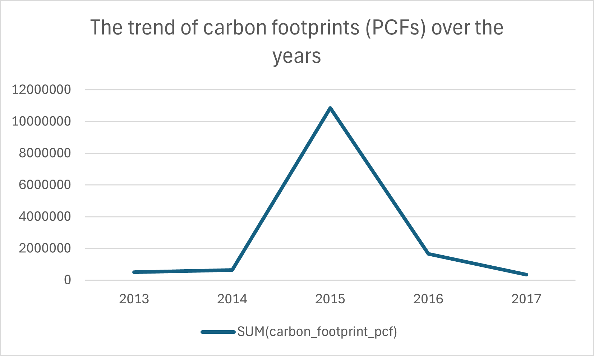

# Carbon-Emission-Analysis

Now, let's look up the data

- ## Product_emissions
```sql
SELECT * FROM product_emissions LIMIT 5;
```

| id           | company_id | country_id | industry_group_id | year | product_name                                                    | weight_kg | carbon_footprint_pcf | upstream_percent_total_pcf | operations_percent_total_pcf | downstream_percent_total_pcf | 
| -----------: | ---------: | ---------: | ----------------: | ---: | --------------------------------------------------------------: | --------: | -------------------: | -------------------------: | ---------------------------: | ---------------------------: | 
| 10056-1-2014 | 82         | 28         | 2                 | 2014 | Frosted Flakes(R) Cereal                                        | 0.7485    | 2                    | 57.50                      | 30.00                        | 12.50                        | 
| 10056-1-2015 | 82         | 28         | 15                | 2015 | "Frosted Flakes, 23 oz, produced in Lancaster, PA (one carton)" | 0.7485    | 2                    | 57.50                      | 30.00                        | 12.50                        | 
| 10222-1-2013 | 83         | 28         | 8                 | 2013 | Office Chair                                                    | 20.68     | 73                   | 80.63                      | 17.36                        | 2.01                         | 
| 10261-1-2017 | 14         | 16         | 25                | 2017 | Multifunction Printers                                          | 110       | 1488                 | 30.65                      | 5.51                         | 63.84                        | 
| 10261-2-2017 | 14         | 16         | 25                | 2017 | Multifunction Printers                                          | 110       | 1818                 | 25.08                      | 4.51                         | 70.41                        | 

  - ## industry_groups
```sql
SELECT * FROM industry_groups LIMIT 5;
```

| id | industry_group                                                         | 
| -: | ---------------------------------------------------------------------: | 
| 1  | "Consumer Durables, Household and Personal Products"                   | 
| 2  | "Food, Beverage & Tobacco"                                             | 
| 3  | "Forest and Paper Products - Forestry, Timber, Pulp and Paper, Rubber" | 
| 4  | "Mining - Iron, Aluminum, Other Metals"                                | 
| 5  | "Pharmaceuticals, Biotechnology & Life Sciences"                       | 

- ## companies
```sql
SELECT * FROM companies LIMIT 5;
```

| id | company_name                  | 
| -: | ----------------------------: | 
| 1  | "Autodesk, Inc."              | 
| 2  | "Casio Computer Co., Ltd."    | 
| 3  | "Cisco Systems, Inc."         | 
| 4  | "CNX Coal Resources, LP"      | 
| 5  | "Coca-Cola Enterprises, Inc." | 

- ## countries
```sql
SELECT * FROM countries LIMIT 5;
```

| id | country_name | 
| -: | -----------: | 
| 1  | Australia    | 
| 2  | Belgium      | 
| 3  | Brazil       | 
| 4  | Canada       | 
| 5  | Chile        | 
  


## Which products contribute the most to carbon emissions?


```sql
SELECT product_name,carbon_footprint_pcf FROM product_emissions GROUP BY product_name
ORDER BY carbon_footprint_pcf DESC LIMIT 10;
```

| product_name                                                                                                                       | carbon_footprint_pcf | 
| ---------------------------------------------------------------------------------------------------------------------------------: | -------------------: | 
| Wind Turbine G128 5 Megawats                                                                                                       | 3718044              | 
| Wind Turbine G132 5 Megawats                                                                                                       | 3276187              | 
| Wind Turbine G114 2 Megawats                                                                                                       | 1532608              | 
| Wind Turbine G90 2 Megawats                                                                                                        | 1251625              | 
| Land Cruiser Prado. FJ Cruiser. Dyna trucks. Toyoace.IMV def unit.                                                                 | 191687               | 
| Retaining wall structure with a main wall (sheet pile): 136 tonnes of steel sheet piles and 4 tonnes of tierods per 100 meter wall | 167000               | 
| TCDE                                                                                                                               | 99075                | 
| Mercedes-Benz GLE (GLE 500 4MATIC)                                                                                                 | 91000                | 
| Mercedes-Benz S-Class (S 500)                                                                                                      | 85000                | 
| Mercedes-Benz SL (SL 350)                                                                                                          | 72000                | 

## The industry groups of these products

```sql
SELECT
	DISTINCT indust.industry_group 
FROM industry_groups indust
JOIN product_emissions product 
ON
product.industry_group_id=indust.id
WHERE product.product_name IN
(SELECT product_name FROM product_emissions GROUP BY product_name
ORDER BY carbon_footprint_pcf DESC) LIMIT 10;
```

| industry_group                                 | 
| ---------------------------------------------: | 
| "Food, Beverage & Tobacco"                     | 
| Food & Beverage Processing                     | 
| Capital Goods                                  | 
| Technology Hardware & Equipment                | 
| Materials                                      | 
| "Textiles, Apparel, Footwear and Luxury Goods" | 
| Consumer Durables & Apparel                    | 
| Software & Services                            | 
| Chemicals                                      | 
| Semiconductors & Semiconductor Equipment       | 


## the industries with the highest contribution to carbon emissions

```sql
SELECT
	 indust.industry_group  
FROM industry_groups indust
JOIN product_emissions product 
ON
product.industry_group_id=indust.id
WHERE product.product_name IN
(SELECT product_name FROM product_emissions GROUP BY product_name
ORDER BY carbon_footprint_pcf DESC) LIMIT 1;
```

| industry_group             | 
| -------------------------: | 
| "Food, Beverage & Tobacco" | 


## the companies with the highest contribution to carbon emissions

```SQL
SELECT
	com.company_name
FROM companies com
JOIN product_emissions product 
ON
com.id=product.company_id
GROUP BY com.company_name ORDER BY carbon_footprint_pcf DESC LIMIT 1;
```

| company_name                           | 
| -------------------------------------: | 
| "Gamesa Corporación Tecnológica, S.A." | 


## the countries with the highest contribution to carbon emissions
```SQL
SELECT
	c.country_name, carbon_footprint_pcf
FROM countries c
JOIN product_emissions product 
ON
c.id=product.country_id
GROUP BY c.country_name ORDER BY carbon_footprint_pcf DESC LIMIT 10; 
```

| country_name | carbon_footprint_pcf | 
| -----------: | -------------------: | 
| Germany      | 21725                | 
| South Korea  | 5846                 | 
| Brazil       | 1750                 | 
| Japan        | 1488                 | 
| India        | 1282                 | 
| Netherlands  | 1200                 | 
| France       | 1102                 | 
| South Africa | 968                  | 
| Ireland      | 746                  | 
| Indonesia    | 721                  | 

## The trend of carbon footprints (PCFs) over the years

```sql
SELECT year, SUM(carbon_footprint_pcf) FROM product_emissions GROUP BY year;
```

| year | SUM(carbon_footprint_pcf) | 
| ---: | ------------------------: | 
| 2013 | 503857                    | 
| 2014 | 624226                    | 
| 2015 | 10840415                  | 
| 2016 | 1640182                   | 
| 2017 | 340271                    | 

 


## Which industry groups has demonstrated the most notable decrease in carbon footprints (PCFs) over time


 


